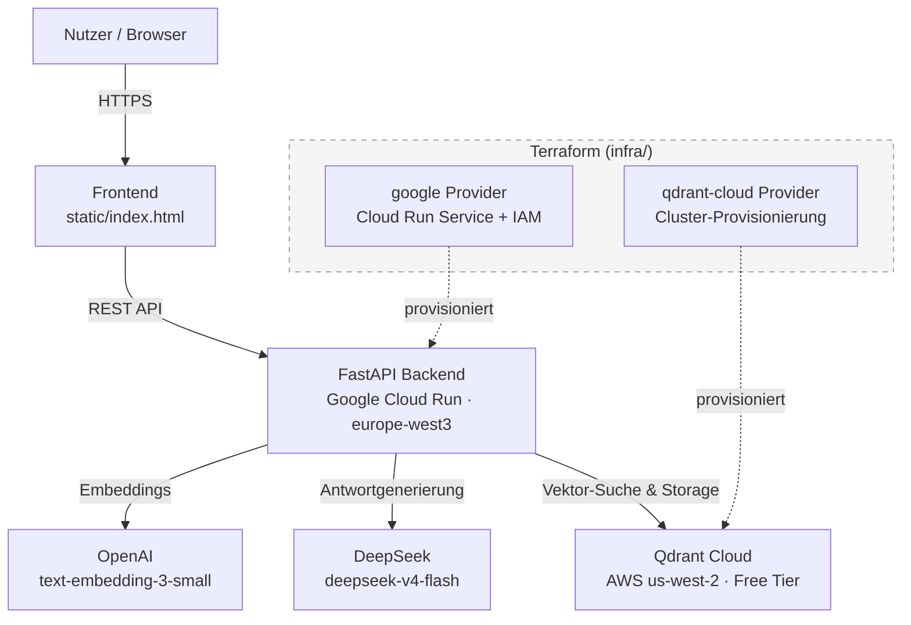

# RAG System – Cloud-Native Deployment mit Terraform

Ein produktiv laufendes Retrieval-Augmented-Generation-System, das Dokumente
durchsuchbar macht und Fragen dazu beantwortet – vollständig auf Google Cloud
Run gehostet und über Terraform deklarativ provisioniert.

**🔗 Live-Demo:** https://rag-backend-mfmw3fed6q-ey.a.run.app/

---

## Inhaltsverzeichnis

- [Was dieses Projekt zeigt](#was-dieses-projekt-zeigt)
- [Architektur](#architektur)
- [Tech-Stack](#tech-stack)
- [Infrastructure as Code](#infrastructure-as-code)
- [Interessante Entscheidungen](#interessante-entscheidungen)
- [Lokal ausführen](#lokal-ausführen)
- [Lizenz](#lizenz)

---

## Was dieses Projekt zeigt

Dieses Repository verbindet bewusst zwei Ebenen, die in vielen Portfolios
getrennt auftauchen, hier aber als ein zusammenhängendes System gedacht sind:

- **Anwendungsebene**: Eine FastAPI-Applikation, die Dokumente per LangChain
  verarbeitet, sie als Embeddings in einer Vektordatenbank ablegt und Fragen
  dazu über ein LLM beantwortet – mit Quellenangaben, nicht halluziniert.
- **Infrastrukturebene**: Die gesamte Cloud-Infrastruktur dahinter –
  Vektordatenbank-Cluster, Container-Deployment, Zugriffsrechte – ist nicht
  von Hand geklickt, sondern vollständig in Terraform beschrieben und
  reproduzierbar (`infra/`).

Der Punkt: Eine funktionierende AI-Anwendung *und* deren produktionsreife,
deklarative Bereitstellung sind hier bewusst ein Stück Arbeit, keine zwei
getrennten Projekte.

---

## Architektur



Der Container (FastAPI + statisches Frontend im selben Image) läuft auf
Cloud Run und skaliert bei Inaktivität auf null Instanzen herunter – keine
Kosten im Leerlauf. Embeddings laufen über OpenAI, die eigentliche
Antwortgenerierung über DeepSeek (bewusster Anbieter-Split, siehe
"Interessante Entscheidungen" unten).

**Ablauf einer Anfrage im Detail:** Beim Hochladen eines Dokuments zerlegt
LangChain den Text in überlappende Chunks (~1000 Zeichen, 200 Zeichen
Overlap), wandelt jeden Chunk über die OpenAI-Embeddings-API in einen Vektor
um und speichert ihn zusammen mit dem Originaltext in einer Qdrant-Collection.
Stellt ein Nutzer über das Frontend eine Frage, wird zuerst *diese Frage*
genauso in einen Embedding-Vektor umgewandelt und gegen die gespeicherten
Chunks in Qdrant verglichen (Vektor-Ähnlichkeitssuche), sodass nur die
inhaltlich relevantesten Textstellen zurückkommen – typischerweise 5–10 von
mehreren hundert Chunks. Diese relevanten Chunks werden zusammen mit der
ursprünglichen Frage als Kontext an DeepSeek geschickt, das daraus eine
Antwort formuliert, die sich ausschließlich auf die gefundenen Textstellen
stützt (statt frei zu halluzinieren) und im Frontend inklusive Quellenangabe
angezeigt wird.

---

## Tech-Stack

| Bereich | Technologie |
|---|---|
| Backend | FastAPI (Python 3.11) |
| Dokumentenverarbeitung | LangChain (`PyPDFLoader`, `RecursiveCharacterTextSplitter`) |
| Embeddings | OpenAI `text-embedding-3-small` |
| Antwortgenerierung (LLM) | DeepSeek `deepseek-v4-flash` |
| Vektordatenbank | Qdrant Cloud (Free Tier) |
| Hosting | Google Cloud Run |
| Image-Registry | Google Artifact Registry |
| Infrastructure as Code | Terraform (`qdrant-cloud` + `google` Provider) |

---

## Infrastructure as Code

Die gesamte Infrastruktur – Vektordatenbank-Cluster **und** Cloud-Run-Deployment
inklusive Zugriffsrechten – wird über Terraform verwaltet. Zwei Provider
arbeiten dabei zusammen; der Output des einen fließt direkt als Input in den
anderen:

```hcl
resource "google_cloud_run_v2_service" "rag_backend" {
  name     = "rag-backend"
  location = var.gcp_region

  template {
    containers {
      image = "${var.gcp_region}-docker.pkg.dev/${var.gcp_project_id}/rag-migration-repo/rag-backend:v5"

      env {
        name  = "QDRANT_SERVER_URL"
        value = qdrant-cloud_accounts_cluster.rag_cluster.url  # <- direkte Referenz auf die Qdrant-Ressource
      }
      # weitere env-Blöcke: API-Keys, Collection-Name ...

      ports {
        container_port = 8080
      }
    }
  }
}

resource "google_cloud_run_v2_service_iam_member" "public_access" {
  location = google_cloud_run_v2_service.rag_backend.location
  name     = google_cloud_run_v2_service.rag_backend.name
  role     = "roles/run.invoker"
  member   = "allUsers"
}
```

```
infra/
├── main.tf          # Provider, Qdrant-Cluster, Cloud-Run-Service, IAM
├── variables.tf      # Projekt-ID, Region, API-Keys, Collection-Namen
└── .terraform.lock.hcl
```

`terraform apply` provisioniert beide Systeme in einem Lauf – vom leeren
Google-Cloud-Projekt bis zur öffentlich erreichbaren, funktionierenden
Anwendung.

---

## Interessante Entscheidungen

- **Anbieter-Split bei den AI-Komponenten**: DeepSeek bietet keine
  Embedding-Modelle an, daher laufen Embeddings weiter über OpenAI, während
  die Antwortgenerierung über DeepSeek läuft (OpenAI-kompatible API, nur
  `base_url` und Modellname geändert – kein Umbau der Anwendungslogik nötig).
- **Region bewusst gewählt, nicht Standard übernommen**: Artifact Registry
  und Cloud Run laufen in `europe-west3` statt der Terraform-Default-Region
  `us-central1` – Entscheidung für Datenresidenz-Nähe zu den verarbeiteten
  Dokumenten.
- **Bewusst offener Zugriff statt Standard-Absicherung**: Der Cloud-Run-Service
  ist über `allUsers` öffentlich erreichbar – keine übersehene Lücke, sondern
  eine begründete Entscheidung für Erreichbarkeit ohne Login-Hürde.
- **Fehlerursachen liegen oft eine Ebene tiefer als vermutet**: Ein
  zeitzonenbedingter Anzeigefehler im Frontend wurde technisch korrekt im
  Backend behoben, bestand aber weiter – die eigentliche Ursache war eine
  hart codierte alte API-URL im Frontend, die den Fix nie zur Wirkung kommen
  ließ. Systematisches Nachverfolgen der gesamten Kette statt Nachbessern am
  ursprünglichen Fix führte zur Lösung.

---

## Lokal ausführen

```bash
git clone <repo-url>
cd <repo>
cp .env.example .env   # eigene API-Keys eintragen
docker build -t rag-backend .
docker run -p 8080:8080 --env-file .env rag-backend
```

Für die Infrastruktur-Provisionierung:

```bash
cd infra
terraform init
terraform plan
terraform apply
```

---

## Lizenz

MIT
